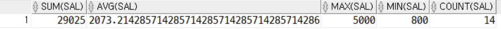

# 📚 Day27_220928

Author: 고범종
Category: 2022
Created Time: 2022년 9월 28일 오전 9:01
Main Category: Log
Status: 🖨 Published
Updated Time: 2022년 9월 28일 오후 9:28

# 1. 데이터 타입

---

## varchar와 char의  특징

**Char는 고정길이 문자열**

- char(10)        >> 10byte >> (한글5자), (영문,특수,공백 10자) >> 고정길이 문자열
- char(10) >> 'abc' >> 3byte >> [a][b][c][][][][][][][] >> 공간의 변화가 없음

**varchar는 가변길이 문자열**

- varchar2(10) >> 10byte >> (한글5자), (영문,특수,공백 10자) >> 가변길이 문자열
- varchar(10) >> 'abc' >> 3byte >> [a][b][c].. >> 데이터 크기만큼만 공간 확보 (빈공간 없어짐)

### [예시]

if 사람의 이름
create table member (name char(30))
create table member (name varchar(30))  (정답!)

if 성별 (남 또는 여)
create table member (name char(3))      (정답!)
create table member (name varchar(3))

### [약속]

고정길이 문자열 ((남,여),(대,중,소),(주민번호))  >> char()   -> 튜닝성능이 더 좋음
가변길이 문자열 (사람의 이름, 취미, 주소)  >> varchar2()

## nchar와 nvarchar2의 특징

char(), varchar2() 고민: 한글과 영어 혼합

nchar == unicode character

**unicode (2byte): 한글, 영문자, 특수문자, 공백 >> 2byte**

**nchar**

nchar(20)       >> 20자 >> 2*20 >> 40byte
nvarchar2(20)   >> 20자

```sql
select * from SYS.NLS_DATABASE_PARAMETERS;
--NLS_CHARACTERSET  : 	AL32UTF8  한글 3byte 인식
--KO16KSC5601 2Byte (현재 변환하면 한글 다깨짐)
select * from nls_database_parameters where parameter like '%CHAR%';
------------------------------------------------------------------------------
create table test2(name varchar2(2));

insert into test2(name) values('a');
insert into test2(name) values('aa');
insert into test2(name) values('가'); --한글 1자 3byte 인지 그래서 추가 x
-------------------------------------------------------------------------------
select * from test2;
```

# 2. 일반함수 (프로그램 성격이 강한 함수)

---

nvl(), nvl2() >> null 처리하는 함수
decode() >> java if문
case()   << java switch문

오라클 SQL (변수, 제어문 개념이 없다)
오라클 PL-SQL(변수, 제어문) 고급기능

## decode (java if문)

### [예시]

```sql
select id, decode(id,100,'아이티',200,'영업부',300,'관리팀','기타부서') as 부서이름
from t_emp;

----------------------------------------------------------------------------------

select id, decode(id,100,'아이티',
                     200,'영업부',
                     300,'관리팀',
                     '기타부서') as 부서이름
from t_emp;
```

위와 아래는 같은 decode 문이지만 아래것이 좀 더 이쁘게 잘 되어있다.

### [다른예시]

```sql
select empno, ename, deptno, decode(deptno, 10, '인사부',
                                            20, '관리부',
                                            30, '회계부',
                                            40, '부서',
                                            'ETC') as 부서이름
from emp;
```

### [문제]

- t_emp2 테이블에서 id, jumin 데이터를 출력하되
- jumin 컬럼의 앞자리가 1이면 '남성' 출력 2이면 '여성' 3이면 '중성' 그외는  '기타' 라고 출력하세요
- 컬럼명은 '성별'

```sql
select id, decode(substr(jumin,1,1), 1,'남성',
                                     2,'여성',
                                     3,'중성',
                                     '기타') as 성별
from t_emp2;

```

[출력]


### [문제]

- 부서번호가 20번인 사원중에서 SMITH 라는 이름을 가진 사원이라면 HELLO 문자 출력하고
- 부서번호가 20번인 사원중에서 SMITH 라는 이름을 가진 사원이 아니라면 WORLD 문자 출력하고
- 부서번호가 20번인 사원이 아니라면 ETC 라는 문자를 출력하세요

```sql
select empno, deptno, decode(deptno, 20, decode(ename, 'SMITH', 'HELLO',
                                        'WORLD'),'ETC')
from emp;
```

[출력]


## CASE문

---

### [사용법]

```sql
--테이블만들기
create table t_zip
(
    zipcode number(10)
);

select * from t_zip;

--값 넣어주기
insert into t_zip(zipcode) values(2);
insert into t_zip(zipcode) values(31);
insert into t_zip(zipcode) values(32);
insert into t_zip(zipcode) values(41);
commit;

-- case문 사용
select '0' || to_char(zipcode) , case zipcode when 2    then '서울'
                                              when 31   then '경기'
                                              when 41   then '제주'
                                              else  '기타지역'
                                 end "지역이름"
from t_zip;
```

case 시작한 열에 맞춰서 end 적어주고

when 시작한거에 쭉쭉 내려가 주면 좋다

### [문제]

- 사원테이블에서 사원급여가 1000달러 이하면 4급
- 1001달러 2000달러 이하면 3급
- 2001달러 3000달러 이하면 2급
- 3001달러 4000달러 이하면 1급
- 4001달러 이상이면 '특급' 이라는 데이터를 출력하세요

```sql
select case when sal <= 1000 then '4급'
            when sal between 1001 and 2000 then '3급'
            when sal between 2001 and 3000 then '2급'
            when sal between 3001 and 4000 then '1급'
            else '특급'
       end "급수" , empno, ename
from emp;
```

[출력]


# 2. 집계함수(그룹) 함수

---

-오라클.pdf (p68)

1. count(*) >> row수, count(컬럼명) >> 데이터 건수 > (null은 포함하지 않아요)
2. sum()
3. ave()
4. mac()
5. min()

---

집계함수는 group by 절과 같이 사용

모든 집계 함수는 null값을 무시한다.

select 절에 집계함수 이외에 다른 컬럼이 오면 반드시 그 컬럼은 group by 절에 명시

### [예시]

```sql
select count(*) from emp; -- 14개의 row  >> 14

select count(empno) from emp; -- >> 14

select count(comm) from emp; -- null값은 제외하고 카운트함 >> 6
select count(nvl(comm,0)) from emp; --point >> 14
```

### [급여의 합_예시]

```sql
select sum(sal) as 급여의합 from emp; -- >> 29025

select round(avg(sal),0) as 급여의평균 from emp; --round를 적어줌으로 정수만 표현 >> 2073
```

### [문제]

- 사장님 우리회의 총 수당이 얼마나 지급 되었나

```sql
select sum(comm) from emp;

select trunc(avg(comm)) from emp; -- 721달러
select trunc(avg(nvl(comm,0))) from emp; -- 309달러
```

- 중간에 Null값을 인정하고 나눴냐 인정 안하고 나눴냐에 따라 값이 달라졌다.

### [집계함수 예시]

```sql
select sum(sal), avg(sal), max(sal), min(sal), count(sal) from emp;
```

[출력]



## group by절 이용하기

---

### [문제]

- 직종별, 평균급여, 급여합, 최대급여, 최소급여, 건수를 출력하세요

```sql
select job, avg(sal), sum(sal), max(sal), min(sal), count(sal)
from emp
group by job;
```

[출력]


### [문제]

- 부서별, 직종별, 급여의 합을 구하세요

```sql
select deptno, job, sum(sal)
from emp
group by deptno, job;
```

[출력]


- 위와같이 그룹을 두개 이상도 지어줄 수 있다.

## 실행순서 (중요)

select 절       4
from 절        1
where 절      2
group by 절 3
order by 절  5

## Having절 이용하기

---

### [문제]

- 직종별 평균급여가 3000달러 이상인 사원의 직종과 평균급여를 출력하세요

```sql
select job, avg(sal) as avgsal
from emp
--where 조건 -- 집계된 결과를 조건을 못해요
group by job
having  avg(sal) >=3000;-- group by 조건절
-- having 절에서는 select 가명칭을 사용불가. (실행순서 때문에)
```

[출력]


만약 위와같은 상황에서
’직종별 평균급여가 3000달러 이상’ 으로 자르려면 어떻게 해야할까?
where을 쓰게되면 순서상 그룹을 짓기전에 자르게 되어 오류가 나게 된다.

**그렇기에 나온것이 having이다.**

having을 이용하면

## 실행순서

select         5
from          1
where        2
group by   3
having       4
order by    6

순서가 그룹을 지어준 후 having으로 자를 수가 있기 때문에 위에 코드로 하면 제대로 출력이 된다.

그리고 순서상 ***having이 select보다 빨라*** 가명칭 사용이 불가하다. 

**[짝궁]**

1. from 조건절 where
2. group by 조건절 having

### [문제 1]

- 사원테이블에서 직종별 급여합을 출력하되 수당은 지급 받고 급여의 합이 5000 이상인
사원들의 목록을 출력하세요
- 급여의 합이 낮은 순으로 출력하세요

```sql
select job, sum(sal) as samsal
from emp
where comm is not null
group by job
having sum(sal) >= 5000
order by samsal asc;
```

[출력]


### [문제 2]

- 사원테이블에서 부서 인원이 4명보다 많은 부서의 부서번호, 인원수, 급여의 합을 출력하세요

```sql
select deptno , count(*) as "부서별인원" , sum(sal) as "부서별 급여의 합"
from emp
group by deptno
having count(*) > 4;
```

[출력]


### TIP)

```sql
select count(*) from emp where job is null; -- null이 있는지 확인해보기
```

### [문제 3]

- 사원테이블에서 직종별 급여의 합이 5000을 초과하는 직종과 급여의 합을 출력하세요
- 단, 판매직종(salesman)은 제외하고 급여합으로 내림차순 정렬하세요

```sql
select job, sum(sal) as "sumsal"
from emp
where job != 'SALESMAN'
group by job
having sum(sal) > 5000
order by sum(sal) desc;

```

[출력]


# 3. JOIN (조인)

---

여러개의 테이블에서 원하는 데이터를 추출하는 방법

- Cartesian Product 모든 가능한 행들의 Join
- Equijoin Join 조건이 정확히 일치하는 경우 사용(일반적으로 PK 와 FK 사용)
- Non-Equijoin Join 조건이 정확히 일치하지 않는 경우에 사용(등급,학점)
- Outer Join Join 조건이 정확히 일치하지 않는 경우에도 모든 행들을 출력
- Self Join 하나의 테이블에서 행들을 Join 하고자 할 경우에 사용
- Set Operators 여러 개의 SELECT 문장을 연결하여 작성한다

## RDBMS (관계형)

관계 (테이블과 테이블과의 관계)

- 1:1
- 1:N (70%)
- M:N

## 등가조인(equl join)

- 원테이블과 대응되는 테이블에 있는 컬럼의 데이터를 1:1 매핑
    - 1. 문법
    - SQL JOIN 문법(오라클 문법) > 간단
    - ANSI 문법 - 권장 > 무조건 > [inner] join on 조건절

### [문법]

```sql
-- sql 문법
select *
from m, s
where m.m1 = s.s1; -- 권장사항 아니다

--ANSI 문법
select *
from m inner join s
on m.m1 = s.s1;

select *
from m join s -- inner를 빼도 위에랑 똑같음
on m.m1 = s.s1; -- join의 조건절
```

이 이하부터는 ANSI문법으로 작성하였음.

### [문제1]

- 사원번호, 사원이름, 부서번호, 부서이름을 출력하세요

```sql
select e.empno, e.ename, e.deptno, d.dname
from emp e join dept d
on e.deptno = d.deptno;
```

[출력]


### [문제 2]

- 사번, 이름(last_name), 부서번호, 부서이름을 출력하세요

```sql
select e.employee_id, e.last_name, e.department_id, d.department_name
from employees e join departments d
on e.department_id = d.department_id;
-- 문제점
-- 사원수 107명 (누군가 누락)
select * from employees where department_id is null;
-- 등가조인 null 처리 불가 >> 다른 조인 >> 잠시 후에
```

[출력]


원래는 107이지만 출력엔 106명이다…
이유는 department_id중 null값이 있기 때문에 제외하고 출력이 되었기 때문이다.

문제 해결은 차차 아래에서 후술하겠다.

## 비등가조인(non-equl join)

---

=> 1:1 로 비교할 컬럼이 없다
ex) 위에 [[문제 2]](%F0%9F%93%9A%20Day27_220928%20d10ed3dd25a74236a65e44d874d47e19.md)에서 on e.department_id = d.department_id; 이것처럼 같은것이 없을경우이다.

- 의미만 존재 >> 등가조인의 문법을 그대로 사용
- 1:1매핑 on emp.deptno = dept.deptno


[salgrade 테이블 값]

이곳에서 최소값 최댓값이 주어져있고
값에 따라 grade가 산정이 되어있다.


[emp 테이블 값]

해당 월급에 따라 grade가 나뉘어지도록 할 것이다.

### [예시]

```sql
select e.empno, e.ename, e.sal, s.grade
from emp e join salgrade s
on e.sal between s.losal and s.hisal;
```


- 이처럼 비교할 컬럼이 없어도 조인이 가능하다.

## 외부조인 (outer join)

---

equl join 먼저 선행하고 나서 + 남아있는 데이터 가져오면 됩니다.

- outer join (주종관계 파악)
- 주인이 되는 테이블의 남은 데이터를 가져 올 수 있다  -- 거의 Null값 출력때문에 가져옴

### 문법

1. left outer join (왼쪽이 주인)
2. right outer join (오른쪽 주인)
3. full outer join (left, right >> union)

이를 통해 위에서 말한 [Null 때문에 스트레스 받던 문제](%F0%9F%93%9A%20Day27_220928%20d10ed3dd25a74236a65e44d874d47e19.md)를 풀 수가 있다.

### [문제]

- 사번, 이름(last_name), 부서번호, 부서이름, 지역코드, 도시명을 출력하시오

```sql
select e.employee_id,
        e.last_name,
        e.department_id,
        d.department_name
from employees e left join departments d 
on e.department_id = d.department_id;
-- 마지막 null값을 가진 회원까지 출력 완료
```

- from employees e left join departments d
위 부분에서 **‘left’를** 작성해 줌으로써 null도 나오도록 할 수 있게 되었다.

## 자기참조 (self join)

---

문법(x) 의미만 존재 >> 등가조인(문법)

- 하나의 테이블에 있는 컬럼이 자신의 테이블에 있는 다른 컬럼을 참조하는 경우
- Emp >> Mgr (관리자)

### [예시]

```sql
select e.empno, e.ename, m.empno, m.ename
from emp e join emp m  -- 가명칭만 다르게 하면 됨
on e.mgr = m.empno; -- 13명

```

[출력]


# 문제풀기

### [문제 1]

- 사원들의 이름, 부서번호, 부서이름을 출력하라.

```sql
SELECT E.ENAME, E.DEPTNO, D.DNAME
FROM EMP E  join DEPT D on E.DEPTNO=D.DEPTNO;
```

[출력]


### [문제 2]

- DALLAS에서 근무하는 사원의 이름, 직종, 부서번호, 부서이름을 출력하라.

```sql
SELECT E.ENAME, E.JOB, D.DEPTNO, D.DNAME
FROM EMP E  join DEPT D on E.DEPTNO=D.DEPTNO
WHERE  D.LOC='DALLAS';
```

[출력]


### [문제 3]

- 이름에 'A'가 들어가는 사원들의 이름과 부서이름을 출력하라.

```sql
SELECT E.ENAME, D.DNAME
FROM EMP E  join DEPT D  on D.DEPTNO=E.DEPTNO
WHERE  E.ENAME LIKE '%A%';
```

[출력]


### [문제 4]

- 사원이름과 그 사원이 속한 부서의 부서명, 그리고 월급을 출력하는데 월급이 3000이상인 사원을 출력하라.

```sql
SELECT E.ENAME, D.DNAME, E.SAL 
FROM EMP E  join DEPT D on E.DEPTNO=D.DEPTNO
WHERE E.SAL>=3000;
```

[출력]


### [문제 5]

- 직위(직종)가 'SALESMAN'인 사원들의 직위와 그 사원이름, 그리고 그 사원이 속한 부서 이름을 출력하라.

```sql
SELECT E.JOB, E.ENAME, D.DNAME
FROM EMP E  join DEPT D on E.DEPTNO=D.DEPTNO
WHERE E.JOB='SALESMAN';
```

[출력]


### [문제 6]

- 커미션이 책정된 사원들의 사원번호, 이름, 연봉, 연봉+커미션,
- 급여등급을 출력하되, 각각의 컬럼명을 '사원번호', '사원이름',
- '연봉','실급여', '급여등급'으로 하여 출력하라.
- (비등가 ) 1 : 1 매핑 대는 컬럼이 없다.

```sql
SELECT         E.EMPNO AS "사원번호",
               E.ENAME AS "사원이름",
               E.SAL*12 AS "연봉",
           --E.SAL*12+NVL(COMM,0) AS "실급여",
               E.SAL*12+COMM AS "실급여",
               S.GRADE AS "급여등급"
FROM EMP E  join SALGRADE S on E.SAL BETWEEN S.LOSAL AND S.HISAL
WHERE E.Comm is not null;
```

[출력]


### [문제 7]

- 부서번호가 10번인 사원들의 부서번호, 부서이름, 사원이름, 월급, 급여등급을 출력하라.

```sql
SELECT E.DEPTNO, D.DNAME, E.ENAME, E.SAL, S.GRADE
FROM EMP E  join DEPT D on E.DEPTNO=D.DEPTNO
            join SALGRADE S on E.SAL BETWEEN S.LOSAL AND S.HISAL
WHERE E.DEPTNO=10;
 
SELECT * FROM SALGRADE;
```

[출력]


### [문제 8]

- 부서번호가 10번, 20번인 사원들의 부서번호, 부서이름,
- 사원이름, 월급, 급여등급을 출력하라. 그리고 그 출력된
- 결과물을 부서번호가 낮은 순으로, 월급이 높은 순으로 정렬하라.

```sql
SELECT E.DEPTNO, D.DNAME, E.ENAME, E.SAL, S.GRADE
FROM EMP E  join DEPT D        on E.DEPTNO=D.DEPTNO
            join SALGRADE S    on E.SAL BETWEEN S.LOSAL AND S.HISAL
WHERE E.DEPTNO IN (10,20) -- WHERE  E.DEPTNO<=20  -- e.deptno = 10 or 
ORDER BY E.DEPTNO ASC,  E.SAL DESC;
```

[출력]


### [문제 9]

- 사원번호와 사원이름, 그리고 그 사원을 관리하는 관리자의
- 사원번호와 사원이름을 출력하되 각각의 컬럼명을 '사원번호',
- '사원이름', '관리자번호', '관리자이름'으로 하여 출력하라.
- SELF JOIN (자기 자신테이블의 컬럼을 참조 하는 경우)

```sql
SELECT E.EMPNO, E.ENAME , M.EMPNO, M.ENAME
FROM EMP E  left outer join EMP M
on e.MGR = m.EMPNO;
```

[출력]


# 기타

---

- -NATURAL JOIN
--Equijoin과 동일하다고 보시면 됩니다.
-- [두 테이블]의 [동일한 이름]을 가지는 칼럼은 [모두 조인]이 됩니다.

```sql
SELECT empno, ename, deptno , dname FROM emp NATURAL JOIN dept ;
```

- -JOIN ~ USING
--NATURAL JOIN의 단점은 동일한 이름을 가지는 칼럼은 모두 조인이 되었는데
--USING 문을 사용하면 컬럼을 선택해서 조인을 할 수가 있습니다.

```sql
SELECT e.empno, e.ename, deptno , dname FROM emp e JOIN dept d USING(deptno);
```

- -조인 조건이 없는 조인결과

```sql
select * from emp , dept;
```