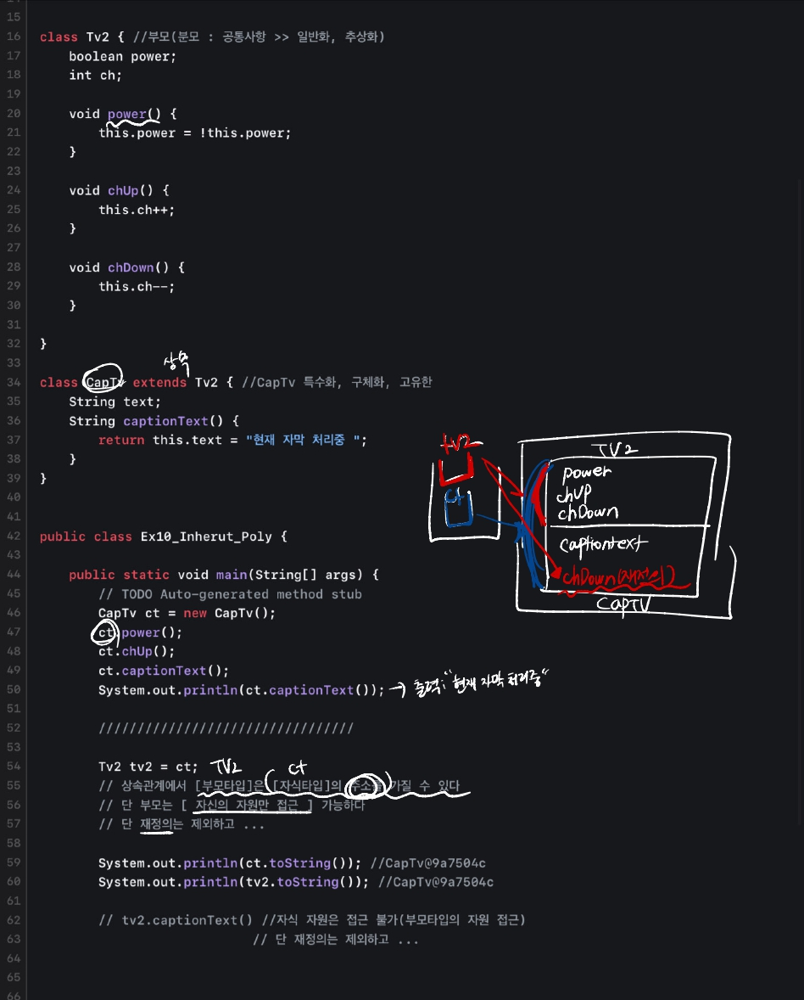
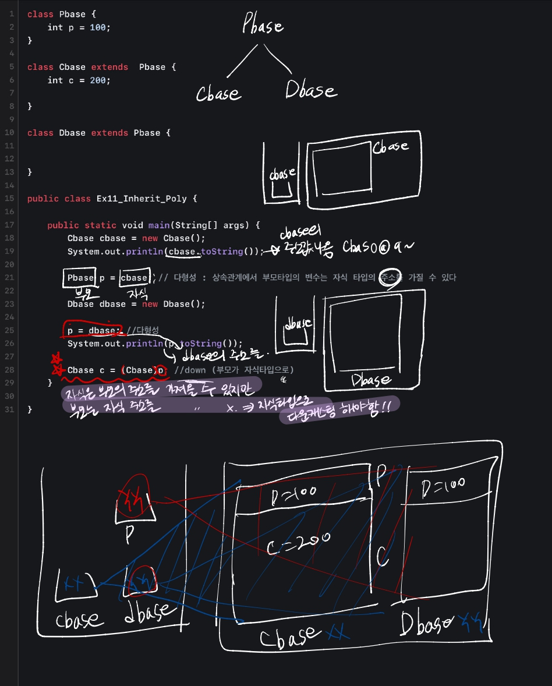
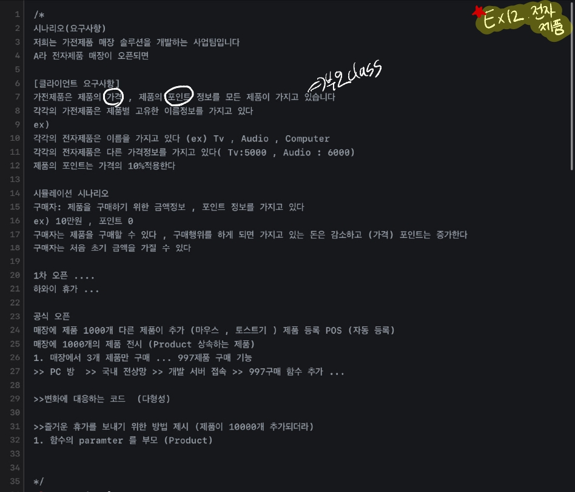
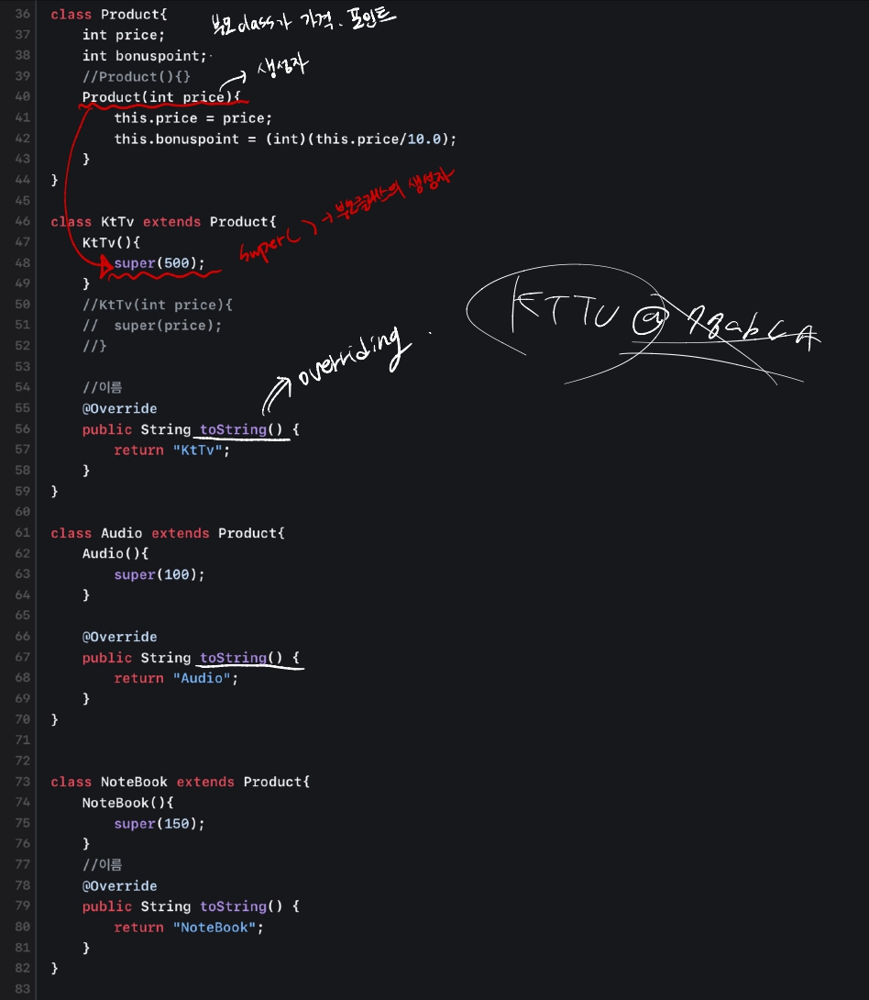
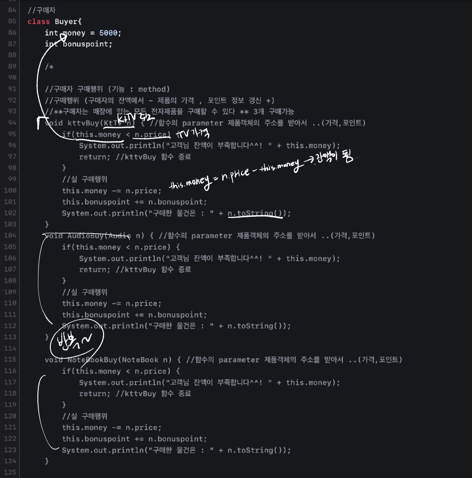
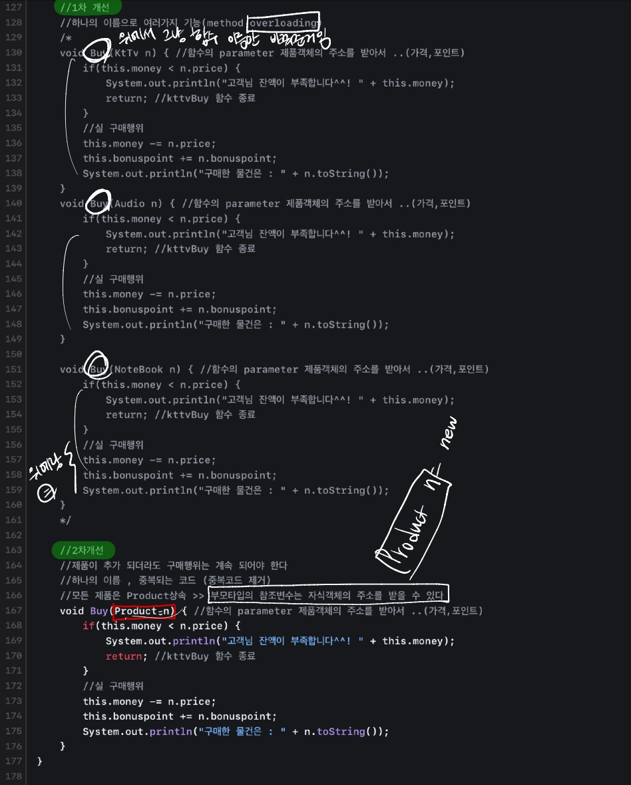

# 2022년 9월 5일 월요일
<br>


## 1. 다형성(Polymorphism)  (*05_Ex10_Inherit_Poly 10~14 ···)
---
    다형성(상속관계에서 존재)
    다형성 : 여러가지 성질(형태) 가질 수 있는 능력

    C# : 다형성(overloading, override)

    JAVA : [상속관계]에서 [하나의 참조변수]가 [여러개의 타입]을 가질 수 있는 것

    [하나의 참조변수] -> [부모타입]
    [여러개의 타입] -> 부모를 상속받은 자식타입

    다형성 : 현실 >> 부모는 자식에게 모든 것을 ...
    프로그램 >> 자식이 부모에게 조건없이 드린다.

### Today's Point!!!
    [상속관계]에서 [하나의 참조변수]가 [여러개의 타입]을 가질 수 있는 것
    상속관계에서 부모타입의 변수는 자식타입의 주소를 가질 수 있다.

    
    ***********************제일 중요함*************************
                src/ex05_OOP/12,13 무조건 봐서 이해하기 
                        (하단에 필기 한 내용있음)
    ***********************제일 중요함*************************


## 2. 싱글톤패턴(Singleton)  (*05_Singleton ···)
---

### 싱글톤 패턴이란?
- 싱글톤(Singleton) 패턴의 정의는 단순하다. 객체의 인스턴스가 오직 1개만 생성되는 패턴을 의미한다.

    디자인 패턴(생성 패턴) >> new

    싱글톤... (객체 하나를 만들어 공유)
    의도 : 하나의 객체를 공유하는 보장 코드...

    ex) 공유IP, 공유프린터 설계할때...

### Class
```java
public class Singleton {
	private static Singleton p;  //p라는 변수가 주소를 가지게 ... new
	private Singleton() {
		//생성자에서 접근자 private .. 생성사 함수 호출 못하니 객체 생성 불가 new ...
	}
	public static Singleton getInstance() {
		if (p == null) {
			p = new Singleton(); //같은 클래스 내부에서는 public, private 보여요 
		}
		return p;
	}
}
```
### Main
```java
Singleton s1 = Singleton.getInstance();
System.out.println(s1);
Singleton s2 = Singleton.getInstance();
System.out.println(s2);
Singleton s3 = Singleton.getInstance();
System.out.println(s3);
```
출력값
    kr.or.kosa.Singleton@6f2b958e
    kr.or.kosa.Singleton@6f2b958e
    kr.or.kosa.Singleton@6f2b958e

같은 객체의 주소를 받다는걸 확인할 수 있다.


## 3. 추상클래스(abstract)    (*06_Ex01_abstract_class)
---
### 추상 클래스
>> 미완성 클래스(설계도)

1. 완성된 코드 + 미완성 코드
2. 완성(함수) 실행블럭이 있는 함수 + 미완성(함수) 실행블럭이 없는 함수
추상코드) >> public void run(){X};
원래코드) >> public void run(){실행블럭};
3. 완성된 클래스 (new 가능) - 미완성 클래스 (스스로 객체 생성 불가)

    설계자 입장에서
    >>의도 >> 반드시 재정의 해라 >> 강제적 구현을 목적으로 (믿지 못하니까)


<br><br>

필기 [출처](https://github.com/HiImJenna) (https://github.com/HiImJenna)
## src/ex05_OOP/12,13 내용






