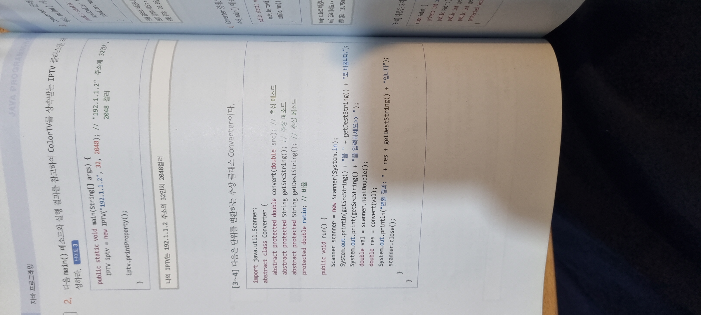
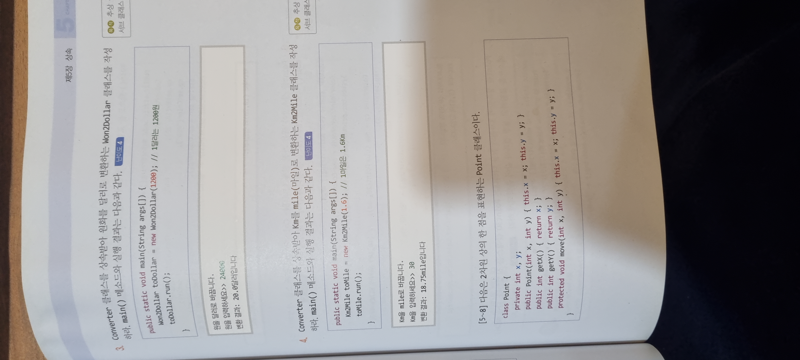

    abstract를 처음봐서 당황했는데 이번 예제를 보면서 왜 쓰는지 알게되었다.

    이런 추상클래스를 이용해 구성을 미리 하고
    오버라이드를 하여 좀 더 편하게 작업을 할 수 있게되었다.

```java
class TV{
    private int size;
    
    public TV(int size) {
    this.size = size;
    }
    protected int getSize() {
        return size;
    }
}

class ColorTV extends TV{
    private int color;

    public int getColor() {
        return color;
    }

    public ColorTV(int size, int color){
        super(size);
        this.color = color;
    }

    public void printProperty(){
        System.out.printf("%d인치 %d컬러",getSize(),getColor());
    }
}

class IPTV extends ColorTV{
    private String ip;

    public String getIp() {
        return ip;
    }

    public void setIp(String ip) {
        this.ip = ip;
    }

    public IPTV(String ip, int size, int color){
        super(size, color);
        this.ip = ip;
    }

    @Override
    public void printProperty() {
        System.out.printf("나의 IPTV는 %s 주소의 %d인치 %d컬러",getIp(),getSize(),getColor());
    }
}


public class Main {
    public static void main(String[] args) {
        // ColorTV myTV = new ColorTV(32, 1024);
        // myTV.printProperty();

        IPTV iptv = new IPTV("192.1.1.2", 32, 2048);
        iptv.printProperty();
    }
}

```